# Architect of Storms  
*Forging Cloud Architecture from the Storm*

---

  

  <em>Architect of Storms – Forging Cloud Architecture from the Storm</em>

***

## About Me

I'm Revaun, building resilient AWS solutions with a focus on CloudFormation, DevOps, and SQL analytics.  
Career goals: AWS Solutions Architect Pro • Machine Learning Specialty • Security Specialty

-  — Professional certification goal  
-  — ML specialty focus  
-  — Security specialty track  
-  — Workflow automation & CI/CD

---

## Architecture Overview
This project demonstrates a multi‑tier CloudFormation stack with scalable services, monitoring, and analytics.

- **VPC** – Isolated networking environment  
- **Application Load Balancer** – Host‑based routing  
- **EC2 Auto Scaling Group** – Scalable compute layer  
- **Amazon RDS** – Managed relational database  
- **CloudWatch Monitoring** – Alarms and dashboards  

## Features
- Automated deployment with IaC (CloudFormation)  
- Host‑based routing for modular components  
- Scalable compute layer with Auto Scaling  
- Managed database with RDS  
- Monitoring and alerting with CloudWatch  
- SQL analytics queries for reporting and trends  

## Deployment
Scripts are provided for quick setup and teardown.

## SQL Analytics Query
---

| Query | Purpose |
| --- | --- |
| **Basic Join** | Combine user, order, and product details |
| **Product Sales Summary** | Summarize sales and order counts per product |
| **User Spending Summary** | Calculate per‑user spending and order counts |
| **Monthly Breakdown** | Month‑by‑month sales and order counts |
| **Rolling 3‑Month Averages** | Smooth trends with moving averages |

<strong>Basic Join</strong>

SELECT u.username, u.email, p.name AS product_name, o.amount, o.created_at
FROM users u
JOIN orders o ON u.id = o.user_id
JOIN products p ON o.product_id = p.id;

<strong>Product Sales Summary</strong>

SELECT p.name AS product_name,
       SUM(o.amount) AS total_sales,
       COUNT(*) AS orders_count
FROM orders o
JOIN products p ON o.product_id = p.id
GROUP BY p.name;

<strong>User Spending Summary</strong>

SELECT u.username,
       COUNT(o.id) AS orders_count,
       SUM(o.amount) AS total_spent
FROM users u
JOIN orders o ON u.id = o.user_id
GROUP BY u.username;

<strong>Monthly Breakdown</strong>

SELECT YEAR(o.created_at) AS year,
       MONTH(o.created_at) AS month,
       p.name AS product_name,
       SUM(o.amount) AS total_sales,
       COUNT(*) AS orders_count
FROM orders o
JOIN products p ON o.product_id = p.id
GROUP BY YEAR(o.created_at), MONTH(o.created_at), p.name
ORDER BY year, month, product_name;

<strong>Rolling 3‑Month Averages</strong>

SELECT p.name AS product_name,
       DATE_FORMAT(o.created_at, '%Y-%m') AS month,
       AVG(SUM(o.amount)) OVER (
           PARTITION BY p.name
           ORDER BY DATE_FORMAT(o.created_at, '%Y-%m')
           ROWS BETWEEN 2 PRECEDING AND CURRENT ROW
       ) AS rolling_avg_sales
FROM orders o
JOIN products p ON o.product_id = p.id
GROUP BY p.name, DATE_FORMAT(o.created_at, '%Y-%m')
ORDER BY p.name, month;

## 📸 Proof Snapshots

**From setup to completion: a full proof trail of the Architect of Storms build**

| Stage | Snapshot |
|-------|----------|
| **Account Setup** | 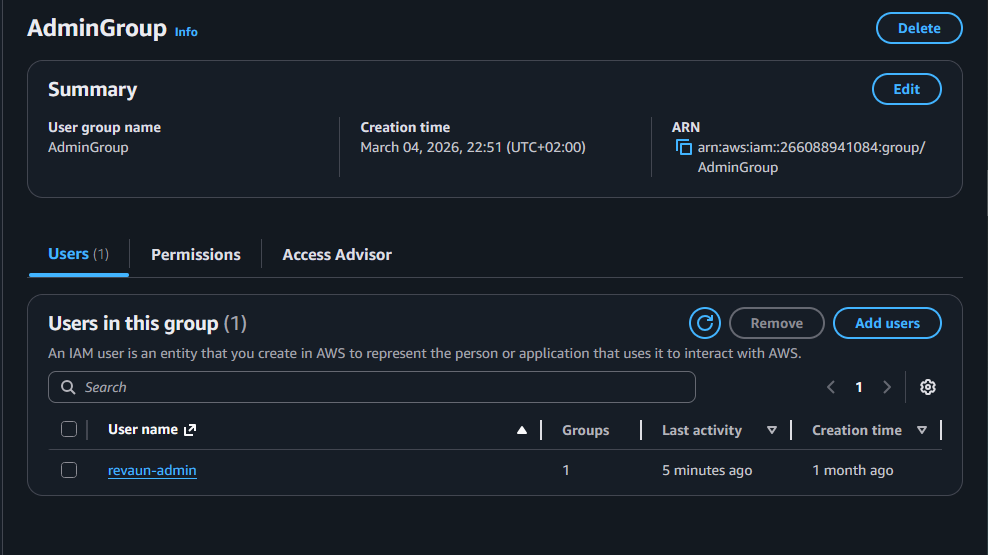 |
| **Agent Status** | 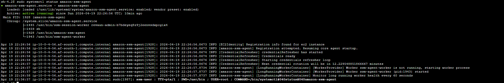 |
| **ALB Created** | 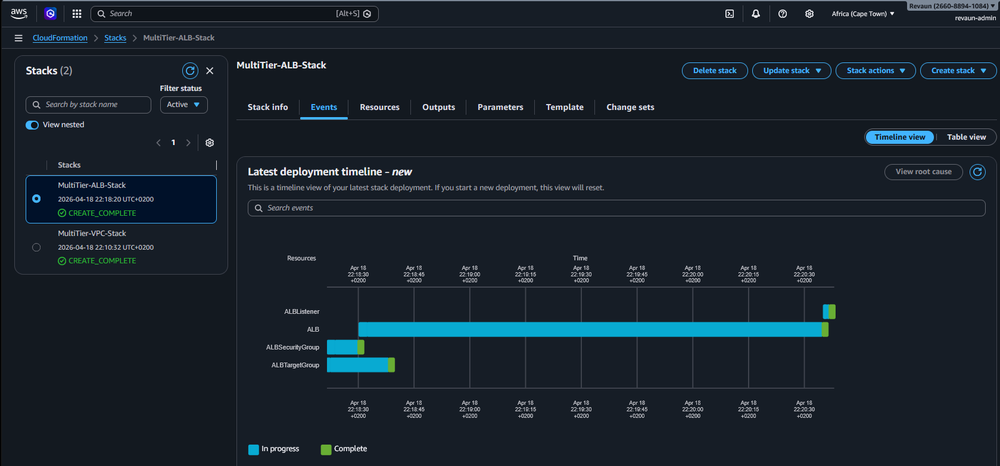 |
| **Architecture Diagram** | 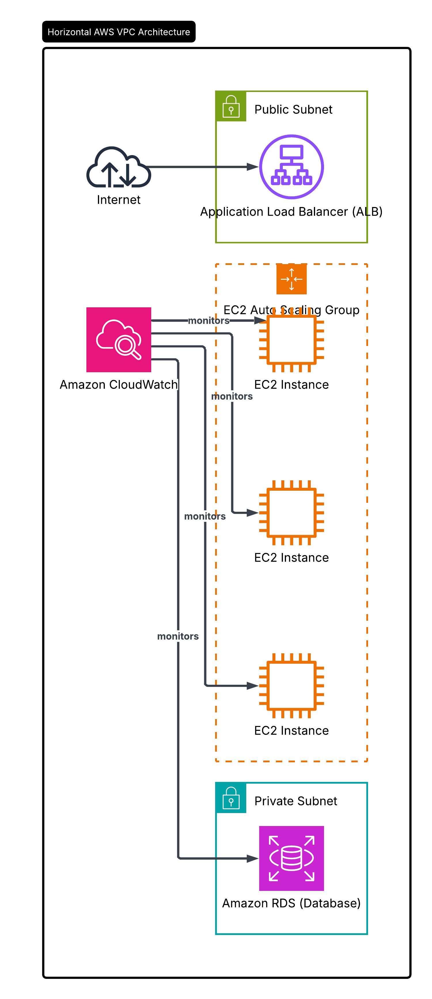 |
| **DB Security Group** | 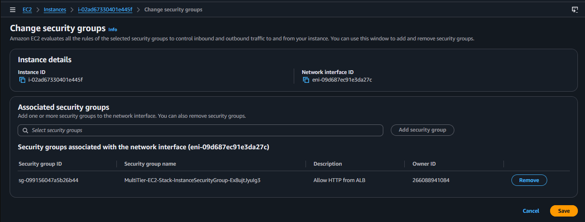 |
| **DB Subnet Group** | 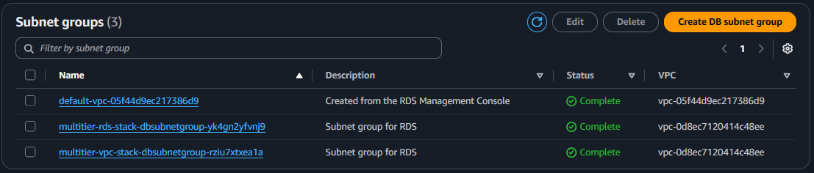 |
| **EC2 AMIs** | 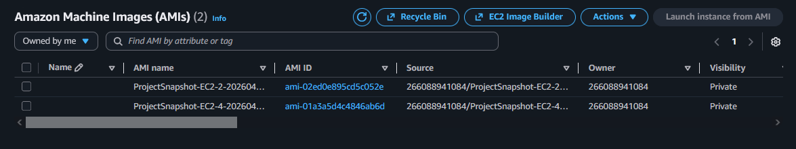 |
| **EC2 Snapshots** | 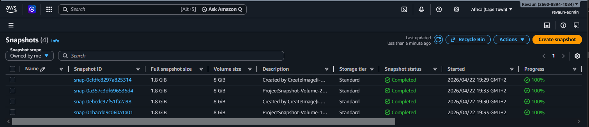 |
| **EC2 SSM Inline Policy** | 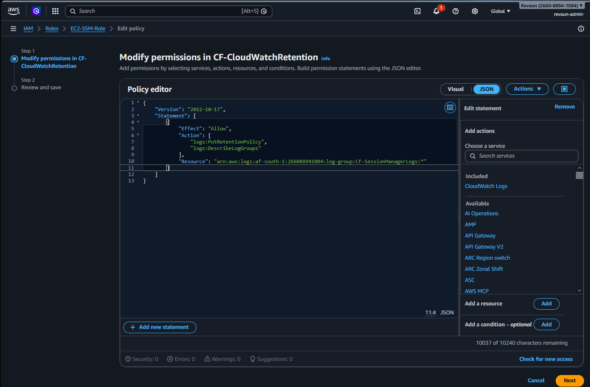 |
| **IAM Role Attached** | 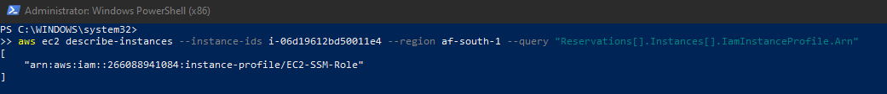 |
| **Join Users + Orders + Products** | 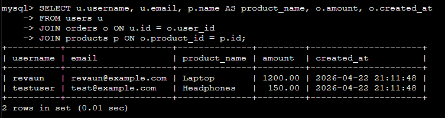 |
| **Monthly Sales Summary** | 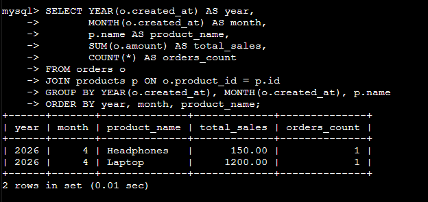 |
| **Orders Schema** | 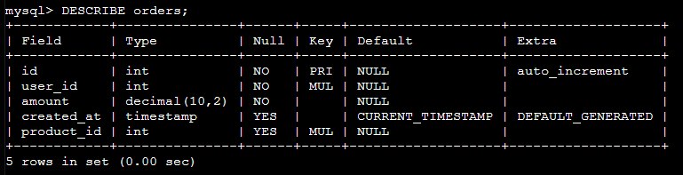 |
| **Product Sales Summary** | 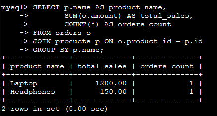 |
| **Products Data** | 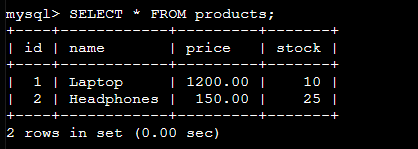 |
| **Products Schema** | 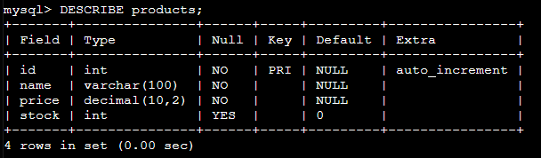 |
| **RDS Created** | 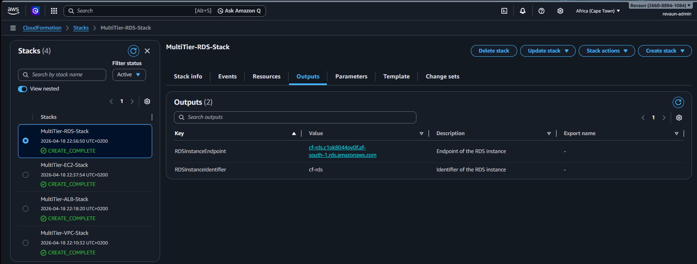 |
| **RDS Instance** | 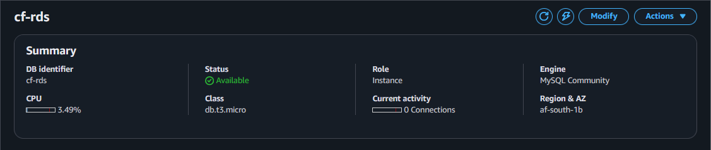 |
| **RDS Snapshots** | 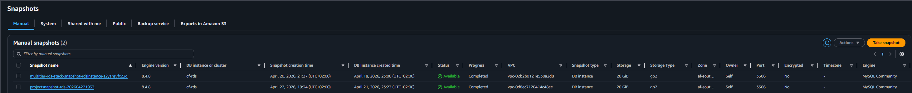 |
| **RDS Stack Complete** | 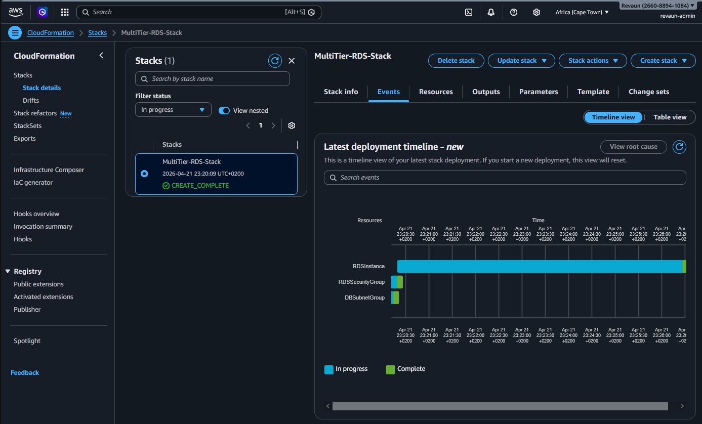 |
| **Repo Layout** | 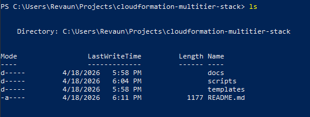 |
| **Role Attachment** | 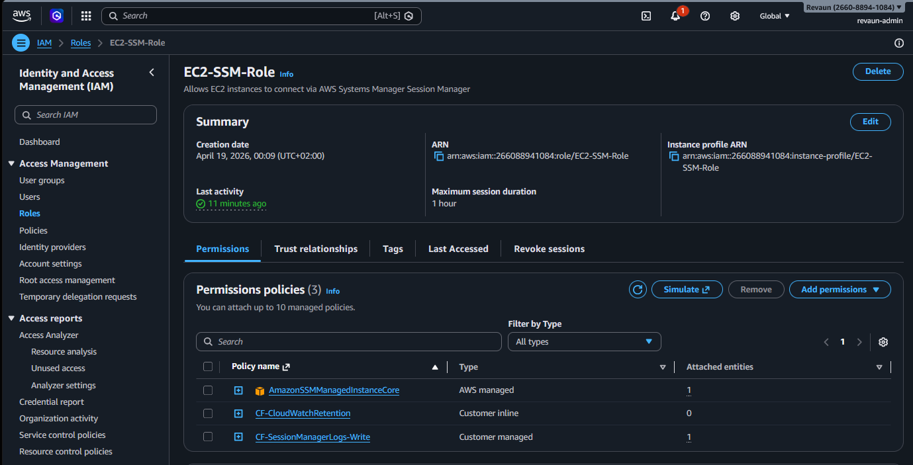 |
| **Rolling Average Sales** | 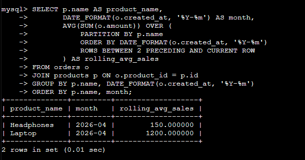 |
| **Session Logging** | 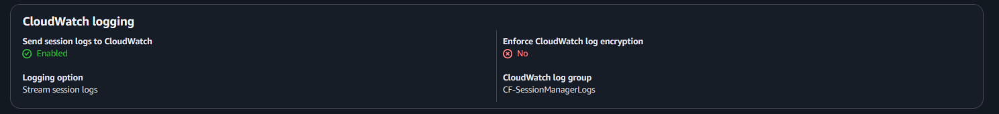 |
| **SSM Registration** | 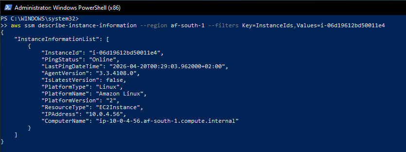 |
| **Stack Created** | 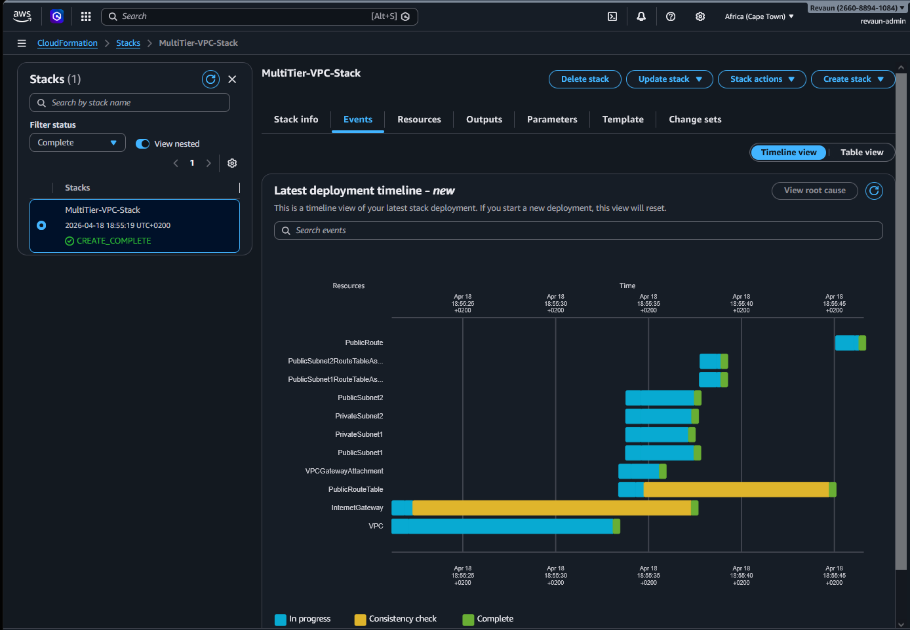 |
| **User Spending Summary** | 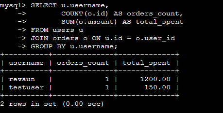 |
| **Users Data** | 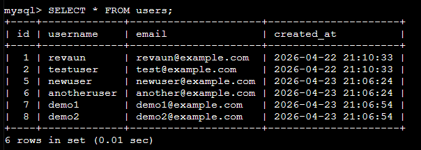 |
| **Users Schema** | 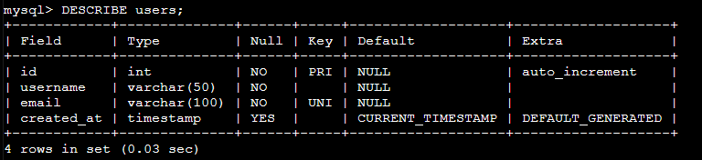 |
| **VPC Created** | 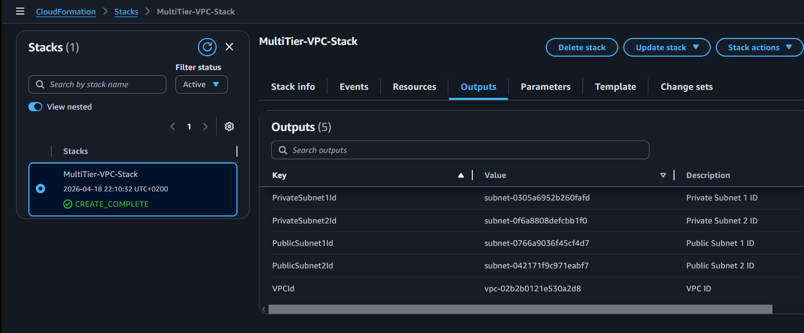 |
| **Final Multi‑Tier Deployment** | 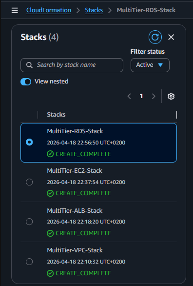 |

## Lessons Learned
- **Infrastructure as Code** simplifies repeatable deployments  
- **SQL syntax discipline** prevents query errors  
- **Schema integrity** ensures data consistency  
- **Joins** build richer insights  
- **Window functions** enable rolling averages  
- **Monitoring with CloudWatch** provides visibility  
- **Documentation with snapshots** proves progress  

## Issues Faced & Resolutions
- **Duplicate Entry Error** → enforced unique constraints  
- **Dead Forecast Link** → removed broken reference  
- **Excessive Badges** → slimmed down for clarity  

## Completion
**This project demonstrates the full lifecycle — from design to proof in the storm.**

Project completed with full proof snapshots and reporting suite.  
**Author:** Revaun • **Date:** April 2026   

## License
MIT License — free to use, modify, and distribute with attribution.  

## Signature
**Architect of Storms**  
*From design to storm, precision in the cloud*

---

  <em>Proof in the Storm, Precision in the Cloud ☁️</em>

