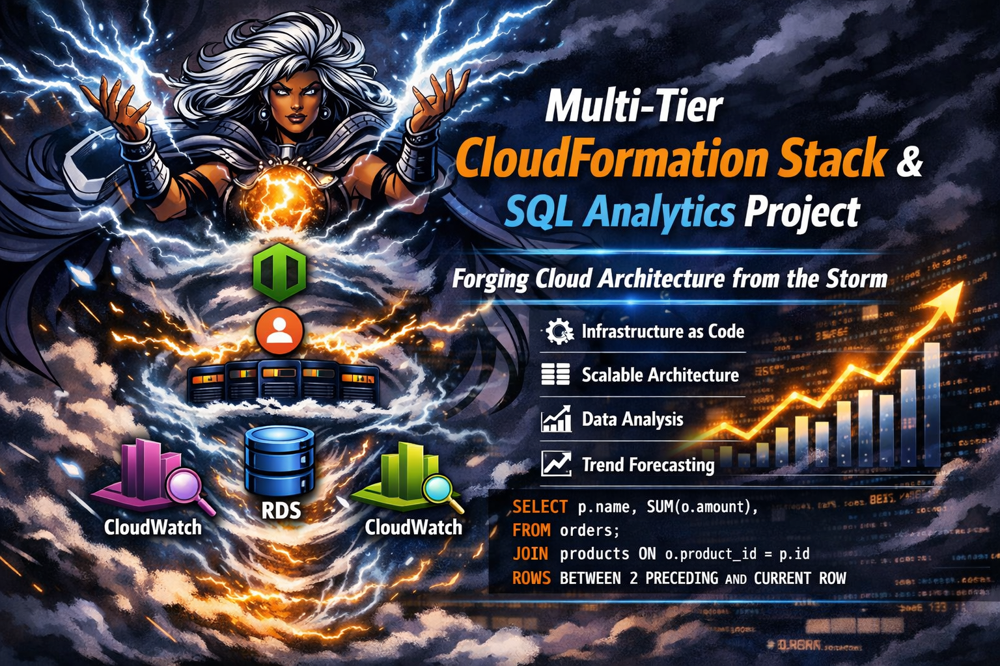

# Architect of Storms  
### CloudFormation Multi‑Tier Stack Project  
#### AWS Solutions Architect Portfolio Project

  

  <em>Architect of Storms – Forging Cloud Architecture from the Storm</em>

---

## About Me

I’m Revaun, a cloud solutions enthusiast and portfolio builder focused on AWS architecture, DevOps practices, and SQL analytics.  
My current goals include achieving AWS Solutions Architect Professional, Machine Learning Specialty, and Security Specialty certifications.  
I design recruiter‑ready projects that combine technical rigor with clear documentation, proof snapshots, and branding under the identity *Architect of Storms*.

### Key Skills
- **AWS CloudFormation** – Infrastructure as Code for scalable deployments  
- **Amazon RDS & SQL Analytics** – Data modeling, joins, reporting  
- **DevOps Practices** – CI/CD, automation, repo organization, workflow optimization  
- **Monitoring & Observability** – CloudWatch dashboards, alarms, budget alerts  
- **Documentation & Branding** – Recruiter‑ready polish, proof snapshots, clear repo structure  

---

## Architecture
- **VPC**: Isolated networking environment  
- **Application Load Balancer**: Host-based routing for web components  
- **EC2 Auto Scaling Group**: Scalable compute layer hosting the application  
- **Amazon RDS**: Managed relational database  
- **CloudWatch Monitoring**: Alarms and dashboards for observability  

---

## Features
- Automated deployment with IaC (CloudFormation)  
- Host-based routing for modular components  
- Scalable compute layer with Auto Scaling  
- Managed database with RDS  
- Monitoring and alerting with CloudWatch  
- SQL analytics queries for reporting and trends  

---

## Proof Snapshots

| Snapshot | Description |
|----------|-------------|
| **Account Setup** | Initial AWS account and IAM configuration. |
| **Architecture Diagram** | High‑level AWS architecture showing VPC, subnets, and routing layers. |
| **EC2 Auto Scaling Group** | Scalable compute layer hosting the application. |
| **RDS Instance** | Managed relational database deployment. |
| **Products Data** | Inserted product dataset for analytics. |
| **Users Data** | Inserted user dataset for analytics. |
| **User Spending Summary** | Query results showing per‑user spending and order counts. |
| **Join Users + Orders + Products** | Combined query output for relational joins. |
| **Monthly Sales Summary** | Month‑by‑month breakdown of product sales. |
| **Rolling Average Sales** | Moving average query output for trend smoothing. |

*(Forecast overlay removed — no snapshot available.)*

---

## Lessons Learned
- Infrastructure as Code simplifies repeatable deployments and cleanup.  
- SQL syntax discipline prevents query errors.  
- Schema integrity ensures data consistency.  
- Joins across users, orders, and products build richer insights.  
- Window functions enable rolling averages.  
- Monitoring with CloudWatch provides visibility into system health.  
- Documentation with snapshots creates undeniable proof of progress.  

---

## Issues Faced & Resolutions
- **Duplicate Entry Error**: Attempted to insert a user with an existing email.  
  *Resolution*: Enforced unique constraints on schema.  
- **Dead Forecast Link**: Forecast overlay PNG did not exist.  
  *Resolution*: Removed reference to forecast snapshot.  
- **Excessive Badges/Quicklinks**: README felt cluttered.  
  *Resolution*: Slimmed down badges, removed “Connect with Me” and “Contribute” sections.  

---

## Project Completion
This project has been successfully completed with full proof snapshots and a reporting suite.  
All schema definitions, data inserts, joins, summaries, time analysis, and rolling averages have been captured and documented.

Author: Revaun  
Date: April 2026  

---

## License
This project is licensed under the **MIT License**.  
You are free to use, modify, and distribute it with proper attribution.  

---

## Badges

---

*Signature: Architect of Storms*  
*Proof in the Storm, Precision in the Cloud*
